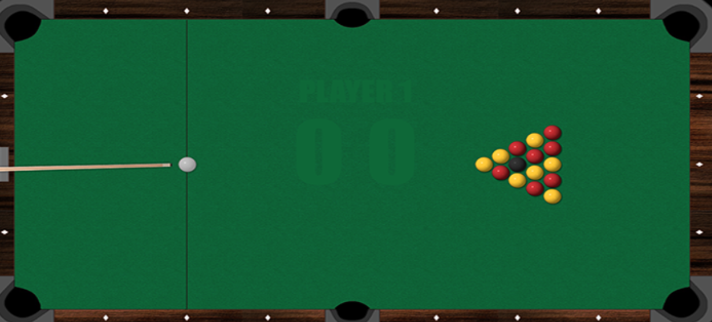

## Pate 1 - Aprendendo sobre colisão 2D na prática

<p align="center">
  
  <br> <a href="https://ggrcursos.com/">ggrcursos.com</a>
</p>

 

### Conteudo
 
> :warning:
Por se tratar de alguns código extensos, irei focar na compreensão do mesmo, evitando de digitar linha por linha, ao invés disso, irei montando o projeto por partes, mas explicando as partes essenciais. 

* **Part 1** 
  * [Um pouco sobre mim 1](#um-pouco-sobre-mim)
  * [Objetivo do curso](#Objetivo-do-curso)
  * [Link do curso no youtube](#link-do-curso-no-youtube)
  * [Tecnologias utilizadas](#tecnologias-utilizadas)
  * [Estrutura do projeto template](#estrutura-do-projeto-template)
  * [CMake na raiz do projeto](#cmake-na-raiz-do-projeto)
  * [Criando um lib ou um executavel com CMake](#criando-um-lib-ou-um-executavel-com-cmake)
  * [Projeto no Visual Studio Code](#projeto-no-visual-studio-code)
  * [Padroes do código ultilizado](#padroes-do-código-ultilizado) 

* **Part 2**
  * <span style="opacity: 0.3; ">Abstraindo a camada e render(grafico) e I/0(teclado, mouse e joystick)</span>
  * <span style="opacity: 0.3; ">Adicionando formas geometricas(ponto,circulo,linha,linha,vetor,retangulo)</span>
  * <span style="opacity: 0.3; ">Criando a classe responsavel por gui</span>
  * <span style="opacity: 0.3; ">Compreensão básica do algoritimo de colisão Sat</span>
  * <span style="opacity: 0.3; ">Implementando os exemplos <b>N Tutorial</b> </span>
* **Part 3**
  * <span style="opacity: 0.3; ">Compreensão básica de fisica e Cálculo aplicada</span>
  * <span style="opacity: 0.3; ">Analisando o core da Box2d Lite</span>
  * <span style="opacity: 0.3; ">Adicionando novas formas geometricas na nossa engine</span>
  * <span style="opacity: 0.3; ">Criando mais testes com as novas formulas</span>
  * <span style="opacity: 0.3; ">Implementando os exemplos <b>N Tutorial</b> </span>
* **Part 4**
  * <span style="opacity: 0.3; ">Atualizar cmke com nova versão, e atualizar do C++17 para o C++20</span>
  * <span style="opacity: 0.3; ">Refatorar a lib de RenderIO para adicionar textures(.png, e se possivel mapeamento de texture .spine)</span>
  * <span style="opacity: 0.3; ">Implementar a estrutura de um jogo com uma maquina de estados</span>
  * <span style="opacity: 0.3; ">Refatora o IO para controlar joystic , mouse e teclado de forma mais simples</span>
  * <span style="opacity: 0.3; ">Modelar um jogo simples de sinuca com apenas um jogador usando nossa engine e com textura(imagens)</span>
  * <span style="opacity: 0.3; ">Criar uma lib básica com Boost::Asio com o modelo client/servidor</span>
  * <span style="opacity: 0.3; ">Criar um server básico e permitir a conexão de 2 usuários simultaneos no jogo de sinuca</span>
#

### Um pouco sobre mim
 Me chamos Gelson Gomes Rodrigues, e sou desenvolvedor C/C++ a mais de 15 anos, e apaixonado por engines de jogos e criação de bibliotecas, buscando sempre aprender nas novas ferramentas, mas sem deixar o parte de programação raiz que o C/C++ sempre exigiu.
 Atualmente trabalhando com sistemas distribuidos e desenvolvendo arquitetura de novos produtos.
#

### Link do curso no youtube 
<center>
[](https://www.youtube.com/watch?v=FmgJl9pIuiM)
  </center>

### Objetivo do curso

Aprender a modelar os exemplos que sempre permeiaram nossos livros de fisica e matematica, dando uma abordagem mais prática em como construir os exemplos, e não apenas em usar o conceito em um jogo/simulação final.
A formula abaixo por exemplo, é facil de facil compreensão, mas como ela realmente é expressada de forma geometrica, e melhor ainda, como podemos a partir dela resolver problemas relacionados a rotacionar um frame(plano cartesiano(corrdenadas x, y  )) em relação ao outro frame?

<center>

$\begin{Bmatrix}
cosθ &-sinθ\\
sin θ & cos θ
\end{Bmatrix} \times \begin{Bmatrix}
x \\ y
\end{Bmatrix}$

</center>


 

O gif abaixo demonstra o que iremos encontrar no decorrer desse curso que será fragmentado em várias partes, mas sempre com progressão.
Nesse gif, ao invés de apensar visualizarmos e interagir com os exemplos, iremos construi-los, ou seja, vamos modelar e implementar um vetor de forma visual, criar um botão da forma mais manual, etc....
<p align="center">
     
</p>


O proximo gif, já demonstra os conceitos aplicados na box2d lite, uma versão simplificada da engine box2D, mas com coneitos avançados para muitos desenvolvedores.

<p align="center">
   
</p>

Será implementado um jogo muito básico de sinunca para demontrar os conceitos apreendidos com a engine e também será adicionado uma cadama importante, a de redes, usando o modelo client/server.

<p align="center">
   
</p>

#

### Tecnologias utilizadas:


  - ``C++17``
  - ``Cmake 3.20``
  - ``Vs Code 1.78.2 (Com tasks e launch.js)``
  - ``Apple clang version 14.0.3 (clang-1403.0.22.14.1)``
  - ``GoogleTest(https://github.com/google/googletest)``
  - ``Render (Glew,Glad,ImgGui)``
  - ``Html5 com javascript Vanilla(mesmo código de C++ porém aplicado em um canvas)``

  [](https://skillicons.dev)

#

### Estrutura do projeto template

```
├── cpp_project
    ├── libGelEngine (Lib responsavel por toda a parte da fisica e matematica aplicada)
        └── src
        └── test
    ├── libGelRenderIO ( Criação de um render generico, podendo adicionar outros frameworks, como Sdl2, glut...)
        └── src
        └── test
    ├── projGelCollision2D ( Executavel contendo toda a lógica para Colisão 2D)
        └── src
          └── main.cpp
        └── test
    ├── README.md
├── html5_project  ( Replica do projeto apenas para exemplificar em outra linguagem)
      ├── libGelEngine 
      ├── libGelRenderIO
      ├── projGelCollision2D
          ├── main.js
    ├──index.html
```

#

### CMake na raiz do projeto

1 - Define uma versão
 ```cpp
      cmake_minimum_required(VERSION 3.0)
  ```
2 - Setar o nome do projeto 
 ```cpp
      project("projectName")
  ```
3 - Adicionar opção para DESABILITAR/HABILITAR funcionalidades como Test, Boost::, ....
 ```cpp
     option(NOME_VARIABEL "Enable/Disable tests" OFF)
  ```
  Para usar
  ```cpp
     if(${NOME_VARIABEL}){...}
  ```
4 - Setar variaveis globais como paths(libs, bin,..) e flags para o compilador
 ```cpp
     set(CMAKE_CXX_STANDARD 17)
     set(CMAKE_CXX_STANDARD_REQUIRED ON)
     set(CMAKE_CXX_EXTENSIONS OFF)
     set(CMAKE_BUILD_TYPE Debug)
     SET(INSTALLATION_PATH ${CMAKE_BINARY_DIR}/Debug)

     set(LIBRARIES_INCLUDE_PATH "usr/local/include")
     set(LIBRARIES_PATH "/usr/loca/lib64")
     set(LIBRARIES_LIB_PATH "/usr/local/lib")
  ```
4 - Para facilitar é possivel baixar e compilar uma lib
 ```cpp
    include(FetchContent)
    FetchContent_Declare(
    googletest
    URL https://github.com/google/googletest/archive/03597a01ee50ed33e9dfd640b249b4be3799d395.zip
    ) 
    set(gtest_force_shared_crt ON CACHE BOOL "" FORCE)
    FetchContent_MakeAvailable(googletest)

    add_subdirectory(test)
  ```
5 - Adicionar todos os subdiretórios que possuem seus próprios CMakeLists.txt
```cpp
     add_subdirectory(diretorio)
```

### Criando um lib ou um executavel com CMake

1 - Percorrer diretório buscando do .cpp e .hppp
```cpp
file(GLOB_RECURSE projectName_SOURCES "${CMAKE_CURRENT_SOURCE_DIR}/*.cpp") 
file(GLOB_RECURSE projectName_HEADERS "${CMAKE_CURRENT_SOURCE_DIR}/*.hpp") 

 
set (projectName_INCLUDE_DIRS "")
foreach (_headerFile ${lprojectName_HEADERS})
    get_filename_component(_dir ${_headerFile} PATH)
    list (APPEND projectName_INCLUDE_DIRS ${_dir})
endforeach()
 
list(REMOVE_DUPLICATES projectName_INCLUDE_DIRS)
```

2 - Criando uma library ou executavel
```cpp
add_library(Nome ${projectName_SOURCES} ${projectName_HEADERS}  ${outras_libs}    )
#ou
add_executable(Nome ${projectName_SOURCES} ${projectName_HEADERS}  ${outras_libs}    )
```
3 - Configuração para a lib/executavel
```cpp
target_include_directories(Nome PUBLIC "${CMAKE_CURRENT_SOURCE_DIR}/")
set_target_properties(Nome PROPERTIES RUNTIME_OUTPUT_DIRECTORY ${INSTALLATION_PATH})
install(TARGETS Nome DESTINATION ${INSTALLATION_PATH})
 ```
4 - Linkando com uma biblioteca
```cpp
set(projectName_TARGET_LIBRARIES
    ${CMAKE_THREAD_LIBS_INIT} #pthread 
    )
target_link_libraries(Nome ${libGelEngine_TARGET_LIBRARIES} ${OPENGL_LIBRARIES})
 ```

 ### Projeto no Visual Studio Code

 ***Obs: Tanto o tasks.json quanto o launch.json , devem ficar dentro da vasta .vscode***

 1 - Criando uma tasks.json
 ```json
 {
	"version": "2.0.0",
	"tasks": [
		{
		  "type": "shell",
		  "label": "nomeTask",
		  "command": "comand_1, comand_2,...",//exemplo: cmake ../, ls, cd folder,etc.....
		  "group": "build",
		  "problemMatcher": []
		}
  ]
}
  ```

 2 - Criando um launch.json
 ```json
 { 
    "version": "0.2.0",
    "configurations": [
      {
        "name": "Nome",
        "type": "cppdbg",
        "request": "launch",
        "cwd": "${workspaceRoot}/",
        "program": "${workspaceFolder}/pastProjeto/build/Debug ou Release/Nome",
        "stopAtEntry": false, 
        "preLaunchTask": "nomeTask",
        "launchCompleteCommand": "exec-run",
        "MIMode": "lldb",//Para Windows possivelmente gdb
        "targetArchitecture": "arm64" // Arquitetura Risc
      }
    ]
 }
 ```


### Padroes do código ultilizado
 
 O padrão não precisa ser rígido, mas em códigos extensos, é importante defini-los.

   | Commando | Descricao |  
   | --- | --- |
   | <b>enum</b> | Initializa com <b style="color:blue">E</b>Nome |
   | <b>strucut, class,namespace</b> | Segue o padrão <b style="color:blue">P</b>ascal<b style="color:blue">C</b>ase |
   | <b>strucut*, class*</b> | Segue o padrão <b style="color:blue">P</b>ascal<b style="color:blue">C</b>ase com <b style="color:blue">Ptr</b> no final |
   | <b>variavel, função, metodo</b> | padrão <b style="color:blue">c</b>amel<b style="color:blue">C</b>ase|
   | <b>interface</b> | Initializa com <b style="color:blue">I</b>Nome |
   | <b>variavéis privadas</b> | usam o prefixo com <b style="color:blue">m_</b>nomeVariavel |
   | <b>variavéis globais</b> | usam o prefixo com <b style="color:blue">g_</b>nomeVariavel |
   | <b>variavéis locais</b> | usam o prefixo com <b style="color:blue">l_</b>nomeVariavel |
   | <b>constantes</b > | <b style="color:blue">UPPER_CASE_COM_UNDESCORE</b>|
   
    
#

### Refencias(livros, sites e videos):

Link  | Descrição
------------- | -------------
|<a href="https://gamesfromwithin.com/when-is-it-ok-not-to-tdd">TDD</a>  | Usabilidade de testes em C++
|<a href="https://www.metanetsoftware.com/technique/tutorialA.html">Tutorial antigo de Sat</a>  | Excelente fonte sobre colisão 2D que irei replicar os exemplos
|<a href="https://github.com/erincatto/box2d-lite">Box2dLite</a>  | Versão incial da Box2D
|<a href="https://www.youtube.com/@codingmath">Javascript com matematica</a> | Video aulas em javascript mas com conceitos bem interessantes 
|<a href="https://www.amazon.com.br/Design-Patterns-Modern-Approaches-Object-Oriented/dp/1484236025">Livro design patterns</a> | O tema dispensa comentários
|<a href="https://www.google.com/imgres?imgurl=https%3A%2F%2Fm.media-amazon.com%2Fimages%2FI%2F51WfngocjgL._AC_UF1000%2C1000_QL80_.jpg&tbnid=KKPTPgCjoxJZLM&vet=12ahUKEwjiv_Kz9ab_AhVON7kGHdQdAB4QMygAegUIARC9AQ..i&imgrefurl=https%3A%2F%2Fwww.amazon.com%2FMathematics-Physics-Programmers-Programming-Kodicek%2Fdp%2F1584503300&docid=pP4aYpewosyK4M&w=804&h=1000&q=physics%20and%20math%20for%20programmers&ved=2ahUKEwjiv_Kz9ab_AhVON7kGHdQdAB4QMygAegUIARC9AQ">Livro de fisica e matemacia para programadores</a> | Exelente material para quem procura algo mais palatavel e compreensivel |
| <a href="https://www.amazon.com.br/C-Programming-Language-Bjarne-Stroustrup/dp/0321563840">Livro de C++11</a>| Livro de mestre, a no leva aos conceitos internos da linaguem
| <a href="http://www.songho.ca/opengl/index.htmll">Desvendando a OpenGl</a> | Excelente material técnico sobre o funcionamento da OpenGl


 
